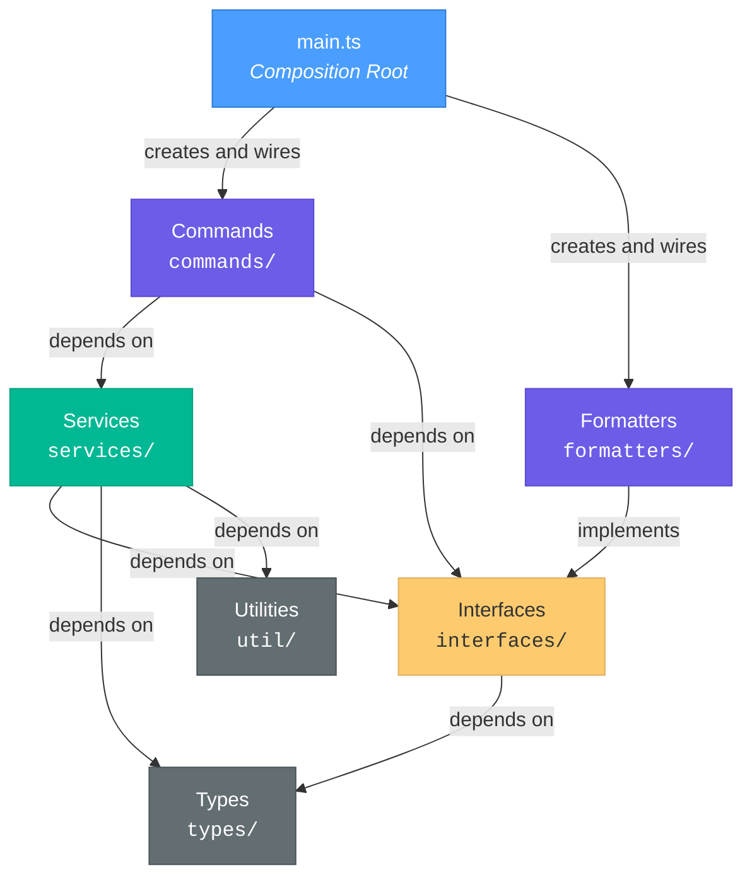
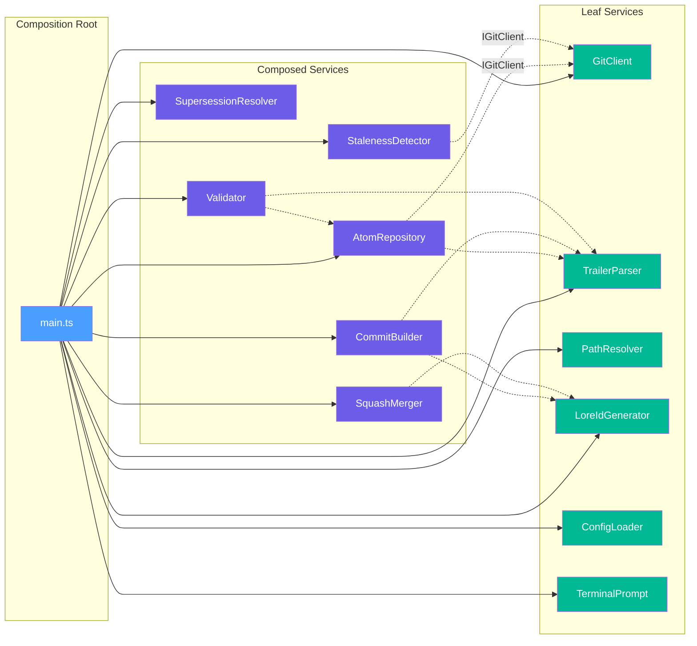
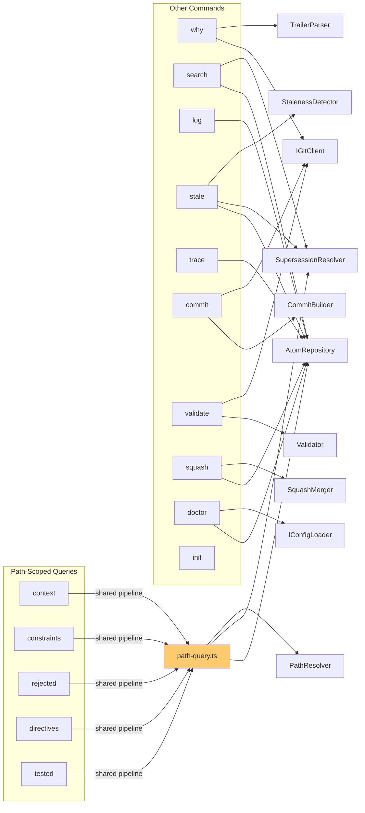
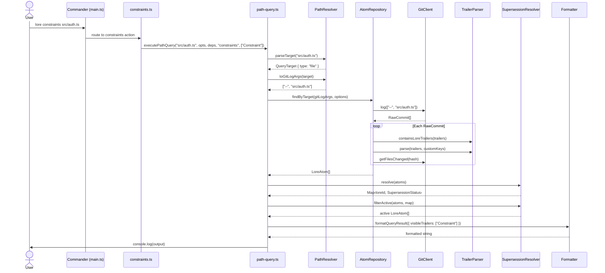
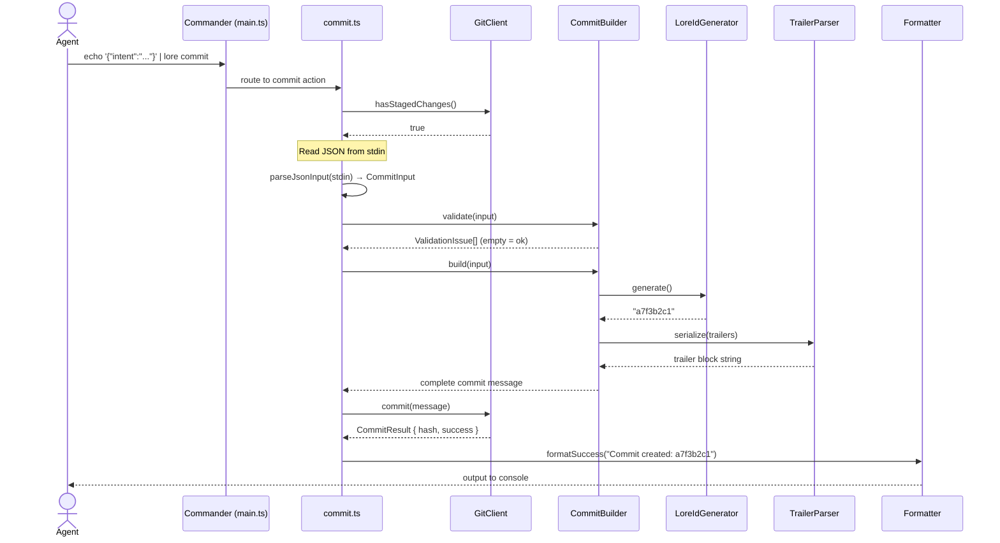
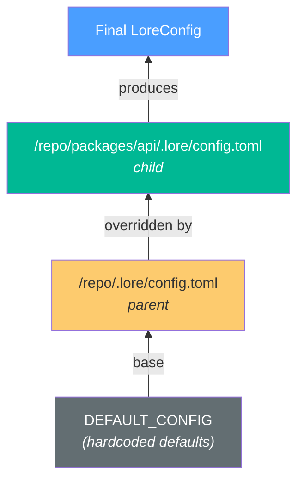
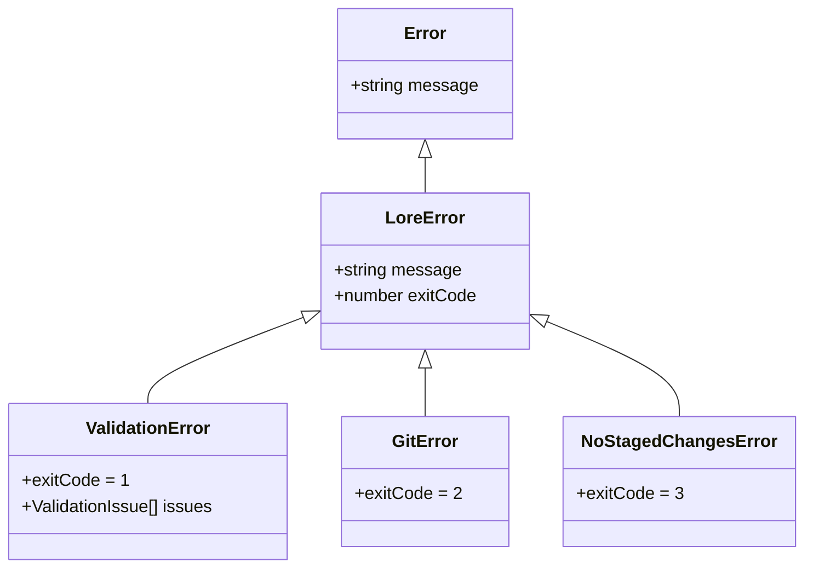

# Lore CLI -- Project Architecture

> Authoritative reference for contributors (human or AI) to the lore-cli codebase.
> Last updated 2026-05-22. Reflects the codebase after the "Flat & Uniform Protocol" refactor.

---

## Table of Contents

1. [Architecture Overview](#1-architecture-overview)
2. [Module Map](#2-module-map)
3. [Design Patterns Applied](#3-design-patterns-applied)
4. [SOLID Compliance Assessment](#4-solid-compliance-assessment)
5. [Service Dependency Graph](#5-service-dependency-graph)
6. [Data Flow](#6-data-flow)
7. [Configuration System](#7-configuration-system)
8. [Error Handling Strategy](#8-error-handling-strategy)
9. [Testing Architecture](#9-testing-architecture)
10. [Known Limitations and Technical Debt](#10-known-limitations-and-technical-debt)
11. [Extension Points](#11-extension-points)

---

## 1. Architecture Overview

### What the Tool Does

`lore-cli` is a CLI tool for the **Lore protocol** -- a convention for embedding structured decision context (constraints, rejected alternatives, directives, confidence levels, test coverage notes, and cross-references) into git commit messages via trailers. The CLI provides:

- **Query commands** (`context`, `constraints`, `rejected`, `directives`, `tested`, `why`, `search`, `log`) that extract and display Lore atoms from git history for a given file, directory, line range, or global scope.
- **Write commands** (`commit`, `squash`) that compose and create Lore-enriched git commits.
- **Maintenance commands** (`validate`, `stale`, `trace`, `doctor`, `init`, `config`) that check protocol compliance, detect stale knowledge, follow decision chains, run health checks, and inspect effective configuration.

### Flat & Uniform Protocol Architecture

The codebase implements a **Flat & Uniform Protocol** architecture. Key principles:

1. **Unified Storage**: All trailer values (core and custom) are stored internally as `readonly string[]` for structural uniformity. Both the domain model (`LoreTrailers`) and input model (`CommitInput`) are simplified to purely dynamic Record types. Scalar coercion (e.g., for JSON output) is handled at the edge based on metadata.
2. **Metadata-Driven**: All logic (parsing, validation, CLI flags, prompting, merging, rendering) is driven by the central `Protocol` service, which acts as the single source of truth for the entire protocol specification.
3. **No Ghosts**: Trailing keys are normalized case-insensitively and authorized via the protocol engine, preventing "ghost trailers" or casing mismatches in the knowledge graph.
4. **Fidelity & Logic Precision**: The system maintains 100% faithful logic for complex protocol rules (like multi-hint expiration in directives or rank-based merging in squashes) while benefiting from the simplified flat data model.

### Layered Architecture

The codebase follows a strict layered architecture with dependencies flowing top-down:



**Layer responsibilities:**

| Layer | Directory | Responsibility |
|-------|-----------|----------------|
| Types | `src/types/` | Domain models, config schema, query/output types. Pure data definitions with zero logic. |
| Interfaces | `src/interfaces/` | Contracts for volatile dependencies (git, config loader, output formatting, terminal prompt). |
| Utilities | `src/util/` | Constants and error types. No behavior, no dependencies on services. |
| Services | `src/services/` | Business logic: parsing, querying, validation, staleness detection, commit building. |
| Formatters | `src/formatters/` | `IOutputFormatter` implementations (text with chalk, JSON). |
| Commands | `src/commands/` | CLI command registration. Thin orchestrators that call services and output via formatters. |
| Main | `src/main.ts` | Composition root. The **only** place concrete classes are instantiated and wired together. |

### Dependency Flow Direction

Dependencies flow **inward and downward** only:

- Commands depend on services and interfaces; never the reverse.
- Services depend on interfaces and types; never on commands or formatters.
- Types and utilities are leaf nodes with no upstream dependencies.

This is enforced by import structure: no file in `services/` imports from `commands/` or `formatters/`.

### Composition Root Pattern

`src/main.ts` is the composition root. It:

1. Instantiates all concrete implementations.
2. Loads configuration.
3. Creates services that depend on others, injecting dependencies via constructors.
4. Creates a **formatter factory** (`getFormatter`) that defers formatter selection to call time based on `--json`/`--format` flags.
5. Registers all commands, passing dependency bags.
6. Parses CLI arguments and runs the selected command.

No command or service instantiates its own dependencies. All wiring is centralized here.

---

## 2. Module Map

### Types Layer

#### `src/types/domain.ts`
- **Contains**: `LoreId` type alias, `TrailerKey`/`ArrayTrailerKey`/`EnumTrailerKey` union types (dynamically mapped from metadata), `LoreTrailers` type alias (flat & uniform Record), `LoreAtom` interface.
- **Single Responsibility**: Defines the core domain model.
- **Uniformity**: Every key in `LoreTrailers` is a `readonly string[]`.

#### `src/types/commit.ts`
- **Contains**: `CommitInput` interface.
- **Single Responsibility**: Defines the input model for the write-path.
- **Alignment**: Reuses `LoreTrailers` for its `trailers` property, ensuring perfect symmetry with the domain model.

#### `src/types/config.ts`
- **Contains**: `LoreConfig` interface, `CustomTrailerDefinition` interface, `ValueDefinition` interface, `DEFAULT_CONFIG` constant.
- **Single Responsibility**: Defines the configuration schema (including rich trailer definitions).

### Services Layer

#### `src/services/protocol.ts`
- **Contains**: `Protocol` class.
- **Single Responsibility**: The master engine for the Lore protocol. Centralizes key authorization, case normalization, metadata retrieval, and semantic grouping (reference keys, list keys, etc.).
- **Pattern**: Information Expert -- owns all protocol metadata.

#### `src/services/trailer-parser.ts`
- **Contains**: `TrailerParser` class.
- **Single Responsibility**: Parses raw trailer text into structured `LoreTrailers` and serializes back.
- **Uniformity**: Coerces all incoming values into string arrays. Uses `Protocol` to normalize keys.

#### `src/services/commit-builder.ts`
- **Contains**: `CommitBuilder` class.
- **Single Responsibility**: Builds a complete git commit message string.
- **Fidelity**: Fully metadata-driven. Sorts trailers in canonical protocol order (Lore-id -> Core -> Custom).

#### `src/services/squash-merger.ts`
- **Contains**: `SquashMerger` class.
- **Single Responsibility**: Merges multiple `LoreAtom` objects.
- **Strategy**: Uses metadata-driven squash strategies (`rank-min`, `rank-max`, `union`) defined in the protocol.

#### `src/services/validator.ts`
- **Contains**: `Validator` class.
- **Single Responsibility**: Validates commits for compliance.
- **Logic**: Enforces cardinality (for single-value trailers), enums, patterns, and requiredness via universal metadata rules.

### Interfaces Layer

#### `src/interfaces/git-client.ts`
- **Contains**: `RawCommit` interface, `BlameLine` interface, `CommitResult` interface, `IGitClient` interface.
- **Single Responsibility**: Defines the contract for all git operations the application needs.
- **Dependencies**: None.
- **Dependents**: `GitClient` (implements), `AtomRepository`, `StalenessDetector`, `commit.ts`, `validate.ts`, `why.ts`.

#### `src/interfaces/config-loader.ts`
- **Contains**: `IConfigLoader` interface.
- **Single Responsibility**: Contract for loading and finding Lore config files.
- **Dependencies**: `config.ts`.
- **Dependents**: `ConfigLoader` (implements), `doctor.ts`, `main.ts`.

#### `src/interfaces/output-formatter.ts`
- **Contains**: `ErrorMessage` interface, `IOutputFormatter` interface.
- **Single Responsibility**: Contract for formatting all output types (queries, validation, staleness, traces, doctor, success, errors).
- **Dependencies**: `output.ts`.
- **Dependents**: `TextFormatter` (implements), `JsonFormatter` (implements), all commands, `main.ts`.

#### `src/interfaces/prompt.ts`
- **Contains**: `IPrompt` interface.
- **Single Responsibility**: Contract for interactive terminal prompts (text, multiline, choice, confirm).
- **Dependencies**: None.
- **Dependents**: `TerminalPrompt` (implements), `commit.ts`, `main.ts`.

#### `src/interfaces/commit-input-reader.ts`
- **Contains**: `ICommitInputReader` interface.
- **Single Responsibility**: Strategy contract for reading commit input from any source.
- **Dependencies**: `CommitInput`.
- **Dependents**: `JsonInputReader`, `FlagsInputReader`, `InteractiveInputReader`, `CommitInputResolver`.

#### `src/interfaces/trailer-collector.ts`
- **Contains**: `ITrailerCollector` interface, `TrailerCollectorResult` type.
- **Single Responsibility**: Strategy contract for collecting a single trailer type interactively.
- **Dependencies**: `IPrompt`, `CommitInput`.
- **Dependents**: `MultiValueTrailerCollector`, `EnumChoiceTrailerCollector`, `InteractiveInputReader`.

### Utilities Layer

#### `src/util/errors.ts`
- **Contains**: `LoreError` class, `ValidationError` class (extends `LoreError`), `GitError` class (extends `LoreError`), `NoStagedChangesError` class (extends `LoreError`).
- **Single Responsibility**: Defines the error hierarchy. Each error carries a semantic exit code.
- **Dependencies**: `output.ts` (`ValidationIssue`).
- **Dependents**: `GitClient`, `commit.ts`, `squash.ts`, `trace.ts`, `why.ts`, `main.ts`.

#### `src/util/constants.ts`
- **Contains**: All protocol constants: `LORE_TRAILER_KEYS`, `ARRAY_TRAILER_KEYS`, `ENUM_TRAILER_KEYS`, valid enum value arrays, `LORE_ID_PATTERN` regex, `REFERENCE_TRAILER_KEYS`, default limits/thresholds, config file names, exit codes.
- **Single Responsibility**: Central registry of all protocol-level constants. Changing a trailer name or adding a new one starts here.
- **Dependencies**: `domain.ts` (type imports only).
- **Dependents**: `TrailerParser`, `PathResolver`, `AtomRepository`, `SupersessionResolver`, `CommitBuilder`, `StalenessDetector`, `Validator`, `init.ts`, `search.ts`, `trace.ts`, `doctor.ts`, `why.ts`.

### Services Layer

#### `src/services/trailer-parser.ts`
- **Contains**: `TrailerParser` class.
- **Single Responsibility**: Parses raw trailer text (multi-line `Key: Value` format) into structured `LoreTrailers` objects, and serializes back. Also detects whether text contains Lore trailers and extracts trailer blocks from full commit messages.
- **Dependencies**: `domain.ts`, `constants.ts`.
- **Dependents**: `AtomRepository`, `CommitBuilder`, `Validator`, `why.ts`, `main.ts`.
- **Key methods**: `parse()`, `serialize()`, `containsLoreTrailers()`, `extractTrailerBlock()`.

#### `src/services/path-resolver.ts`
- **Contains**: `PathResolver` class.
- **Single Responsibility**: Classifies a CLI target string (e.g., `src/auth.ts:45-80`) into a `QueryTarget` and converts it to git log or git blame arguments.
- **Dependencies**: `query.ts`.
- **Dependents**: Commands (`context`, `constraints`, `rejected`, `directives`, `tested`, `stale`, `why`), `main.ts`.
- **Key methods**: `parseTarget()`, `toGitLogArgs()`, `toGitBlameArgs()`.

#### `src/services/lore-id-generator.ts`
- **Contains**: `LoreIdGenerator` class.
- **Single Responsibility**: Generates 8-character random hex Lore IDs using `crypto.randomBytes`.
- **Dependencies**: `domain.ts`, `constants.ts`, Node.js `crypto`.
- **Dependents**: `CommitBuilder`, `SquashMerger`, `main.ts`.
- **Key methods**: `generate()`.

#### `src/services/atom-repository.ts`
- **Contains**: `AtomRepository` class.
- **Single Responsibility**: Central query engine. Retrieves `LoreAtom` objects from git history by target path, Lore-id, revision range, scope, or globally. Handles follow-link BFS traversal.
- **Dependencies**: `IGitClient`, `TrailerParser`, `domain.ts`, `query.ts`, `constants.ts`.
- **Dependents**: Commands (`context`, `constraints`, `rejected`, `directives`, `tested`, `search`, `log`, `stale`, `trace`, `squash`, `doctor`), `Validator`, `main.ts`.
- **Key methods**: `findByTarget()`, `findByLoreId()`, `findByRange()`, `findAll()`, `findByScope()`, `resolveFollowLinks()`.

#### `src/services/supersession-resolver.ts`
- **Contains**: `SupersessionResolver` class.
- **Single Responsibility**: Computes which Lore atoms are superseded (replaced by newer atoms) and resolves transitive supersession chains.
- **Dependencies**: `domain.ts`, `constants.ts`.
- **Dependents**: Commands (`context`, `constraints`, `rejected`, `directives`, `tested`, `search`, `stale`), `main.ts`.
- **Key methods**: `resolve()`, `filterActive()`.

#### `src/services/staleness-detector.ts`
- **Contains**: `StalenessDetector` class.
- **Single Responsibility**: Multi-signal staleness analysis. Checks five signals: age, drift (commits since atom), low confidence, expired `[until:...]` hints in directives, and orphaned dependencies.
- **Dependencies**: `IGitClient`, `LoreConfig`, `domain.ts`, `output.ts`, `constants.ts`.
- **Dependents**: `stale.ts`, `main.ts`.
- **Key methods**: `analyze()`.

#### `src/services/commit-builder.ts`
- **Contains**: `CommitInput` interface, `CommitBuilder` class.
- **Single Responsibility**: Builds a complete git commit message string from structured input (intent, body, trailers) and validates the input before building.
- **Dependencies**: `TrailerParser`, `LoreIdGenerator`, `LoreConfig`, `domain.ts`, `output.ts`, `constants.ts`.
- **Dependents**: `commit.ts`, `main.ts`.
- **Key methods**: `build()`, `validate()`.

#### `src/services/squash-merger.ts`
- **Contains**: `SquashMerger` class.
- **Single Responsibility**: Merges multiple `LoreAtom` objects into a single commit message for squash-merge scenarios. Handles trailer deduplication, enum merging (most conservative for confidence, least conservative for risk), and reference filtering.
- **Dependencies**: `LoreIdGenerator`, `domain.ts`.
- **Dependents**: `squash.ts`, `main.ts`.
- **Key methods**: `merge()`.

#### `src/services/validator.ts`
- **Contains**: `Validator` class.
- **Single Responsibility**: Validates existing git commits for Lore protocol compliance. Checks 10 rules: trailer format, Lore-id presence/format, enum values, intent length, required trailers, message length, reference formats, trailer counts, and reference existence.
- **Dependencies**: `TrailerParser`, `AtomRepository`, `LoreConfig`, `IGitClient`, `domain.ts`, `output.ts`, `constants.ts`.
- **Dependents**: `validate.ts`, `main.ts`.
- **Key methods**: `validate()`.

#### `src/services/config-loader.ts`
- **Contains**: `ConfigLoader` class.
- **Single Responsibility**: Loads `.lore/config.toml` files, walks up the directory tree for monorepo support, merges multiple config files (child overrides parent), and fills in defaults.
- **Dependencies**: `IConfigLoader`, `LoreConfig`, `constants.ts`, Node.js `fs`, `path`, `smol-toml`.
- **Dependents**: `main.ts`, `doctor.ts`.
- **Key methods**: `loadForPath()`, `loadFromFile()`, `findConfigPath()`.

#### `src/services/git-client.ts`
- **Contains**: `GitClient` class.
- **Single Responsibility**: Wraps the git CLI via `child_process.execFile`. Translates git output formats into `RawCommit` and `BlameLine` objects.
- **Dependencies**: `IGitClient`, `errors.ts`, Node.js `child_process`.
- **Dependents**: `main.ts` (instantiation only; all other code depends on `IGitClient`).
- **Key methods**: `log()`, `blame()`, `commit()`, `hasStagedChanges()`, `getRepoRoot()`, `isInsideRepo()`, `getFilesChanged()`, `countCommitsSince()`, `resolveRef()`.

#### `src/services/terminal-prompt.ts`
- **Contains**: `TerminalPrompt` class.
- **Single Responsibility**: Interactive terminal prompts using Node.js `readline/promises`. Lazy-initializes the readline interface.
- **Dependencies**: `IPrompt`, Node.js `readline/promises`.
- **Dependents**: `main.ts` (instantiation only; command depends on `IPrompt`).
- **Key methods**: `askText()`, `askMultiline()`, `askChoice()`, `askConfirm()`, `close()`.

#### `src/services/commit-input-resolver.ts`
- **Contains**: `InputMode` enum, `CommitCommandOptions` interface, `CommitInputResolver` class.
- **Single Responsibility**: Pure dispatcher — resolves which input mode applies (interactive, file, flags, stdin) and delegates to the correct `ICommitInputReader` implementation. Owns I/O helpers for reading file content and stdin.
- **Dependencies**: `IPrompt`, `ICommitInputReader` implementations, `CommitInput`.
- **Dependents**: `commit.ts`, `main.ts`.
- **Key methods**: `resolve()`.
- **Pattern**: Record dispatch map over `InputMode` enum (OCP-compliant).

#### `src/services/readers/json-input-reader.ts`
- **Contains**: `JsonInputReader` class implementing `ICommitInputReader`.
- **Single Responsibility**: Parses a JSON string into `CommitInput`. Coerces single strings to arrays for array trailers.
- **Dependencies**: `ICommitInputReader`, `CommitInput`.

#### `src/services/readers/flags-input-reader.ts`
- **Contains**: `FlagsInputReader` class implementing `ICommitInputReader`.
- **Single Responsibility**: Maps CLI flag values to `CommitInput`. Pure data mapping, no I/O.
- **Dependencies**: `ICommitInputReader`, `CommitInput`, `CommitCommandOptions`.

#### `src/services/readers/interactive-input-reader.ts`
- **Contains**: `InteractiveInputReader` class implementing `ICommitInputReader`.
- **Single Responsibility**: Collects `CommitInput` via terminal prompts using Template Method pattern.
- **Dependencies**: `ICommitInputReader`, `IPrompt`, `ITrailerCollector[]`, `PROMPT_STRINGS`.
- **Pattern**: Template Method — `read()` calls `collectIntent()`, `collectBody()`, `collectTrailers()`.

#### `src/services/readers/collectors/multi-value-trailer-collector.ts`
- **Contains**: `MultiValueTrailerCollector` class implementing `ITrailerCollector`.
- **Single Responsibility**: Collects zero or more string values for array-type trailers via confirm-then-loop.

#### `src/services/readers/collectors/enum-choice-trailer-collector.ts`
- **Contains**: `EnumChoiceTrailerCollector` class implementing `ITrailerCollector`.
- **Single Responsibility**: Collects a single enum choice via confirm-then-choose.

#### `src/services/readers/collectors/trailer-collector-registry.ts`
- **Contains**: `createTrailerCollectors()` factory function.
- **Single Responsibility**: Configuration site — creates all 11 trailer collectors with their prompt strings and enum values.
- **Pattern**: GRASP Creator — owns the initializing data.

#### `src/services/search-filter.ts`
- **Contains**: `SearchFilter` class.
- **Single Responsibility**: Filtering and text matching logic for the `lore search` command. Extracted from `search.ts` per GRASP Controller (commands coordinate, not compute).
- **Dependencies**: `LoreAtom`, `SearchOptions`, `ARRAY_TRAILER_KEYS`, `ENUM_TRAILER_KEYS`.
- **Dependents**: `search.ts`, `main.ts`.

### Formatters Layer

#### `src/formatters/text-formatter.ts`
- **Contains**: `TextFormatter` class.
- **Single Responsibility**: Human-readable terminal output with chalk coloring. Formats all result types (queries, validation, staleness, traces, doctor results, success, errors).
- **Dependencies**: `IOutputFormatter`, `output.ts`, `domain.ts`, `chalk`.
- **Dependents**: `main.ts`.
- **Key methods**: All `IOutputFormatter` methods.

#### `src/formatters/json-formatter.ts`
- **Contains**: `JsonFormatter` class.
- **Single Responsibility**: Machine-readable JSON output. Converts all result types to `lore_version: "1.0"` prefixed JSON with snake_case keys.
- **Dependencies**: `IOutputFormatter`, `output.ts`, `domain.ts`.
- **Dependents**: `main.ts`.
- **Key methods**: All `IOutputFormatter` methods.

### Commands Layer

#### `src/commands/helpers/path-query.ts`
- **Contains**: `PathQueryDeps` interface, `PathQueryCommandOptions` interface, `executePathQuery()` function, `addPathQueryOptions()` function.
- **Single Responsibility**: Shared pipeline for path-scoped query commands. Implements a resolve -> query -> follow -> supersession -> filter -> format pipeline. Parameterized by `visibleTrailers` to control which trailers each command shows.
- **Dependencies**: `AtomRepository`, `SupersessionResolver`, `PathResolver`, `IOutputFormatter`, `LoreConfig`, types.
- **Dependents**: `context.ts`, `constraints.ts`, `rejected.ts`, `directives.ts`, `tested.ts`.

#### `src/commands/config.ts`
- **Contains**: `registerConfigCommand()` function.
- **Single Responsibility**: Outputs the effective configuration and trailer definitions (core and custom) for the current path. Performs runtime parsing of directives and normalization of values.

#### `src/commands/init.ts`
- **Contains**: `registerInitCommand()` function.
- **Single Responsibility**: Creates `.lore/config.toml` with default content. Shows existing config if already present.
- **Dependencies**: `IOutputFormatter`, `constants.ts`, Node.js `fs`.

#### `src/commands/context.ts`
- **Contains**: `registerContextCommand()` function.
- **Single Responsibility**: Full lore summary showing ALL trailer types. Delegates to `executePathQuery()` with `visibleTrailers: 'all'`.
- **Dependencies**: `path-query.ts`.

#### `src/commands/constraints.ts`
- **Contains**: `registerConstraintsCommand()` function.
- **Single Responsibility**: Shows only `Constraint` trailers. Delegates to `executePathQuery()` with `visibleTrailers: ['Constraint']`.
- **Dependencies**: `path-query.ts`.

#### `src/commands/rejected.ts`
- **Contains**: `registerRejectedCommand()` function.
- **Single Responsibility**: Shows only `Rejected` trailers. Delegates to `executePathQuery()` with `visibleTrailers: ['Rejected']`.
- **Dependencies**: `path-query.ts`.

#### `src/commands/directives.ts`
- **Contains**: `registerDirectivesCommand()` function.
- **Single Responsibility**: Shows only `Directive` trailers. Delegates to `executePathQuery()` with `visibleTrailers: ['Directive']`.
- **Dependencies**: `path-query.ts`.

#### `src/commands/tested.ts`
- **Contains**: `registerTestedCommand()` function.
- **Single Responsibility**: Shows `Tested` and `Not-tested` trailers. Delegates to `executePathQuery()` with `visibleTrailers: ['Tested', 'Not-tested']`.
- **Dependencies**: `path-query.ts`.

#### `src/commands/why.ts`
- **Contains**: `registerWhyCommand()` function.
- **Single Responsibility**: Decision context for a specific line/range. Uses `git blame` to find commits touching those lines, then extracts Lore trailers from each unique blame commit.
- **Dependencies**: `TrailerParser`, `IGitClient`, `PathResolver`, `IOutputFormatter`, `constants.ts`, `errors.ts`.

#### `src/commands/search.ts`
- **Contains**: `registerSearchCommand()` function, `applySearchFilters()`, `atomHasTrailer()`, `atomMatchesText()`, `buildSearchTargetDescription()` helper functions.
- **Single Responsibility**: Cross-cutting search across all Lore atoms with filters (confidence, scope-risk, reversibility, has-trailer, author, scope, text, date range).
- **Dependencies**: `AtomRepository`, `SupersessionResolver`, `IOutputFormatter`, types, `constants.ts`.

#### `src/commands/log.ts`
- **Contains**: `registerLogCommand()` function.
- **Single Responsibility**: Lore-enriched git log. Shows all Lore-enriched commits, optionally filtered by path (passed after `--`).
- **Dependencies**: `AtomRepository`, `IOutputFormatter`, types.

#### `src/commands/stale.ts`
- **Contains**: `registerStaleCommand()` function.
- **Single Responsibility**: Orchestrates staleness detection. Optionally scoped to a target path. Filters by CLI-level staleness signal options.
- **Dependencies**: `AtomRepository`, `SupersessionResolver`, `StalenessDetector`, `PathResolver`, `IOutputFormatter`, types.

#### `src/commands/trace.ts`
- **Contains**: `registerTraceCommand()` function.
- **Single Responsibility**: BFS traversal of the decision chain starting from a Lore-id, following `Supersedes`, `Depends-on`, and `Related` references.
- **Dependencies**: `AtomRepository`, `IOutputFormatter`, `errors.ts`, `constants.ts`.

#### `src/commands/commit.ts`
- **Contains**: `registerCommitCommand()` function plus input-parsing and interactive-collection helpers.
- **Single Responsibility**: Creates Lore-enriched commits. Supports four input modes: stdin JSON (default), file JSON, CLI flags, and interactive prompts.
- **Dependencies**: `CommitBuilder`, `IGitClient`, `IOutputFormatter`, `IPrompt`, `errors.ts`, `constants.ts`.

#### `src/commands/validate.ts`
- **Contains**: `registerValidateCommand()` function.
- **Single Responsibility**: Validates commits for Lore protocol compliance. Supports revision range, `--since`, `--last`, and `--strict` modes.
- **Dependencies**: `Validator`, `IGitClient`, `IOutputFormatter`, types.

#### `src/commands/squash.ts`
- **Contains**: `registerSquashCommand()` function.
- **Single Responsibility**: Takes a git revision range, gets all Lore atoms, and outputs a merged commit message via `SquashMerger`.
- **Dependencies**: `AtomRepository`, `SquashMerger`, `IOutputFormatter`, `errors.ts`.

#### `src/commands/doctor.ts`
- **Contains**: `registerDoctorCommand()` function plus health-check helpers.
- **Single Responsibility**: Runs four health checks: config validity, Lore-id uniqueness, reference resolution, and orphaned dependencies.
- **Dependencies**: `AtomRepository`, `IConfigLoader`, `IOutputFormatter`, `constants.ts`.

### Entry Point

#### `src/main.ts`
- **Contains**: `main()` async function, top-level error handler.
- **Single Responsibility**: Composition root. Instantiates all concrete implementations, wires dependencies, registers commands, and runs the CLI.
- **Dependencies**: All service classes, all command registration functions, all interfaces, `LoreError`, `commander`.
- **Dependents**: None (it is the entry point).

---

## 3. Design Patterns Applied

### Adapter (GoF -- Structural)

**Where**: `GitClient` (`src/services/git-client.ts`)

**Why**: The volatile git CLI (which uses `child_process.execFile`, custom format strings, and porcelain output) is wrapped behind the stable `IGitClient` domain interface. The `GitClient` class translates between the git binary's text-based protocol and the application's `RawCommit`/`BlameLine` types.

**How**: `GitClient implements IGitClient`. The `exec()` private method runs git commands and converts errors to `GitError`. Private parser methods (`parseLogOutput`, `parseLFlagOutput`, `parseBlameOutput`) adapt git's various output formats into the application's data structures.

---

### Strategy (GoF -- Behavioral)

**Where**: `IOutputFormatter` with `TextFormatter` and `JsonFormatter` (`src/interfaces/output-formatter.ts`, `src/formatters/`)

**Why**: The output format (human-readable text vs. machine-readable JSON) varies by user preference (`--json`, `--format`). Both formatters implement the same `IOutputFormatter` interface, and the strategy is selected at runtime by the `getFormatter()` factory in `main.ts` (line 91).

**How**: Each command calls `getFormatter()` at call time, which reads the CLI flags and returns the appropriate formatter. Commands are completely decoupled from output format concerns.

---

### Template Method (GoF -- Behavioral -- via Composition)

**Where**: `executePathQuery()` in `src/commands/helpers/path-query.ts`

**Why**: Five commands (`context`, `constraints`, `rejected`, `directives`, `tested`) follow the same six-step pipeline but differ only in which trailers they display. Rather than using inheritance, the "template" is a shared function parameterized by `commandName` and `visibleTrailers`.

**How**: The pipeline steps are:
1. Resolve target (path or scope).
2. Query atoms via `AtomRepository`.
3. Follow links if requested.
4. Compute supersession.
5. Filter superseded atoms.
6. Format and output.

Each command calls `executePathQuery()` with its specific `visibleTrailers` parameter, making the step-variation explicit.

---

### Composition Root (DI Pattern)

**Where**: `main()` in `src/main.ts`

**Why**: To honor DIP (no service instantiates its own dependencies) and centralize all concrete-to-interface wiring in one place.

**How**: `main()` creates all concrete instances, loads config, wires services together via constructor injection, and passes dependency bags to command registration functions. The entire object graph is built here.

---

### Pure Fabrication (GRASP)

**Where**:
- `AtomRepository` -- persistence access abstracted from domain logic.
- `ConfigLoader` -- filesystem I/O abstracted from domain.
- `LoreIdGenerator` -- random ID generation extracted as infrastructure.
- `TerminalPrompt` -- terminal I/O extracted as infrastructure.

**Why**: These classes don't represent domain concepts (there is no "repository" or "prompt" in the Lore protocol domain). They exist to decouple domain logic from infrastructure concerns (git, filesystem, crypto, terminal), improving testability and cohesion.

---

### Information Expert (GRASP)

**Where**:
- `TrailerParser` -- knows trailer format rules and owns parsing/serialization.
- `PathResolver` -- knows path classification rules and owns target-to-git-args translation.
- `SupersessionResolver` -- knows supersession logic and has access to the `Supersedes` trailer data.
- `StalenessDetector` -- knows staleness rules (age, drift, confidence, expired hints, orphaned deps).

**Why**: Each class owns the behavior that operates on the data it has. `TrailerParser` has the format rules, so it does the parsing. `SupersessionResolver` needs `Supersedes` trailers, which live on atoms, so it receives the atoms.

---

### Protected Variations (GRASP)

**Where**:
- `IGitClient` wraps the volatile git CLI.
- `IConfigLoader` wraps volatile filesystem config loading.
- `IPrompt` wraps volatile terminal I/O.
- `IOutputFormatter` wraps the output format decision.

**Why**: All four are points of predicted variation. Git might change its output format. Config might come from a different source. Terminal I/O might be replaced by a GUI. Output format might gain new variants. Wrapping them behind stable interfaces isolates the rest of the system.

---

### Factory Method (GoF -- Creational -- Lightweight)

**Where**: `getFormatter()` closure in `main.ts`

**Why**: Formatter creation depends on runtime CLI flags (`--json`, `--format`) which aren't known until command execution. The factory defers creation and selection to call time.

**How**: The closure captures a reference to the `program` object and reads its options at invocation time, returning either `TextFormatter` or `JsonFormatter`.

---

### Controller (GRASP)

**Where**: All command files in `src/commands/`

**Why**: Commands are thin orchestrators. They parse CLI options, delegate to services for business logic, and delegate to formatters for output. They contain no business logic themselves.

**How**: Each `register*Command()` function registers a Commander `action` callback that:
1. Reads options.
2. Calls service methods.
3. Calls formatter methods.
4. Writes to `console.log`.

---

## 4. SOLID Compliance Assessment

### S -- Single Responsibility Principle

**Followed well:**
- Every service class has a clear, single responsibility. `TrailerParser` only parses/serializes. `PathResolver` only resolves targets. `LoreIdGenerator` only generates IDs. `SupersessionResolver` only computes supersession chains.
- The `CommitBuilder` separates validation (`validate()`) from message construction (`build()`), but both relate to the single responsibility of "preparing a commit message."
- Commands are thin controllers. Business logic is in services.
- The `path-query.ts` helper eliminates duplication across five commands by extracting the shared pipeline.

**Gaps / Risks:**
- `AtomRepository` has the most methods of any service (7 public: `findByTarget`, `findByLoreId`, `findByCommitHash`, `findByRange`, `findAll`, `findByScope`, `resolveFollowLinks`). While all relate to "retrieving atoms from git," the `resolveFollowLinks` BFS traversal is a distinct concern that could be extracted into a `FollowLinkResolver` service.
- `Validator` has 10 validation rules implemented as private methods within a single class. If the rule set grows, a rule-based dispatch pattern (array of validation rule objects) would improve OCP compliance.
- Search filtering is extracted into the `SearchFilter` service class with `applyFilters()`, `atomHasTrailer()`, and `atomMatchesText()` methods.

### O -- Open/Closed Principle

**Followed well:**
- The `IOutputFormatter` interface + Strategy pattern means adding a new output format (e.g., YAML) requires only a new class -- no modification to existing code.
- Adding a new path-scoped query command (e.g., `lore risks`) requires only a new file calling `executePathQuery()` with a different `visibleTrailers` list.

**Gaps / Risks:**
- `atomHasTrailer()` in `SearchFilter` uses a data-driven lookup via `ARRAY_TRAILER_KEYS` and `ENUM_TRAILER_KEYS`, which is OCP-compliant for standard trailer types.
- `TextFormatter.formatTrailers()` has an `if` block for each trailer key. Adding a new trailer type requires modifying this method. A data-driven approach (iterating over `LORE_TRAILER_KEYS` with a config for display) would eliminate this.
- `Validator.trailerHasValue()` has a `switch` over all trailer keys. Same structural issue.
- The staleness signals in `StalenessDetector.analyze()` are hardcoded as five sequential method calls. A signal-registry approach would make it open for extension.

### L -- Liskov Substitution Principle

**Followed well:**
- `TextFormatter` and `JsonFormatter` are fully substitutable for `IOutputFormatter`. All seven interface methods are implemented by both.
- `GitClient` fully implements `IGitClient`. All nine methods are present with correct signatures.
- `ConfigLoader` fully implements `IConfigLoader`. All three methods are present.
- `TerminalPrompt` fully implements `IPrompt`. All five methods are present.

**Gaps / Risks:**
- No violations detected. The interface hierarchy is flat (no inheritance beyond `LoreError` subtypes), and all implementations fully honor their contracts.

### I -- Interface Segregation Principle

**Followed well:**
- `IPrompt` is focused (5 methods, all related to prompting).
- `IConfigLoader` is minimal (3 methods).
- `IGitClient` has 9 methods, which is on the boundary but acceptable because all callers use a subset and the interface represents a single external system.

**Gaps / Risks:**
- `IOutputFormatter` has 7 methods. All current implementers (`TextFormatter`, `JsonFormatter`) implement all 7. However, if a formatter only needed to support queries (not validation, staleness, etc.), it would be forced to implement unused methods. Splitting into `IQueryFormatter`, `IValidationFormatter`, etc. would improve ISP but might be premature given only two implementers exist.

### D -- Dependency Inversion Principle

**Followed well:**
- All services depend on interfaces, not concrete implementations. `AtomRepository` depends on `IGitClient`, not `GitClient`. `CommitBuilder` depends on `TrailerParser` (class type used as interface -- see gap below).
- All wiring happens in `main.ts`. No service uses `new` to create its own dependencies.

**Gaps / Risks:**
- Several services depend on concrete class types rather than interfaces: `AtomRepository` takes `TrailerParser` directly, `CommitBuilder` takes `TrailerParser` and `LoreIdGenerator`, `Validator` takes `TrailerParser` and `AtomRepository`, `SquashMerger` takes `LoreIdGenerator`. These classes don't have corresponding `I*` interfaces. While this works for constructor injection, it means tests must use the real class or use duck typing. Extracting interfaces (`ITrailerParser`, `IAtomRepository`, `ILoreIdGenerator`) would strengthen DIP and make mock boundaries explicit.
- The `path-query.ts` helper's `PathQueryDeps` interface references concrete class types (`AtomRepository`, `SupersessionResolver`, `PathResolver`) instead of interfaces. Same issue.

---

## 5. Service Dependency Graph



#### Command Dependency Map



### Constructor Injection Signatures

```typescript
AtomRepository(
  gitClient: IGitClient,
  trailerParser: TrailerParser,
  customTrailerKeys: readonly string[]
)

SupersessionResolver()  // no dependencies

StalenessDetector(
  gitClient: IGitClient,
  config: LoreConfig
)

CommitBuilder(
  trailerParser: TrailerParser,
  loreIdGenerator: LoreIdGenerator,
  config: LoreConfig
)

SquashMerger(
  loreIdGenerator: LoreIdGenerator
)

Validator(
  trailerParser: TrailerParser,
  atomRepository: AtomRepository,
  config: LoreConfig
)

GitClient(cwd?: string)          // defaults to process.cwd()
ConfigLoader()                   // no dependencies
TerminalPrompt()                 // no dependencies
TrailerParser()                  // no dependencies
PathResolver()                   // no dependencies
LoreIdGenerator()                // no dependencies
TextFormatter({ color: boolean })
JsonFormatter()                  // no dependencies
CommitInputResolver(prompt: IPrompt, config: LoreConfig)
```

---

## 6. Data Flow

### Query Flow: `lore constraints src/auth.ts`



### Commit Flow: Agent pipes JSON to `lore commit`



---

## 7. Configuration System

### Config File Location

The Lore config file is located at `.lore/config.toml` relative to the project root. The constants for these paths are:

```
CONFIG_DIR = '.lore'          (src/util/constants.ts, line 49)
CONFIG_FILENAME = 'config.toml'  (src/util/constants.ts, line 48)
```

### Monorepo Merging

`ConfigLoader.loadForPath()` (line 28) walks **up the directory tree** from the target path to the filesystem root, collecting all `.lore/config.toml` files found along the way.

Multiple config files are merged with **child overrides parent**. The files are ordered nearest-to-farthest, reversed, and merged parent-first so the nearest config wins.



Merge strategy: **shallow merge at the section level**. If the child defines `[validation]`, the entire `[validation]` section replaces the parent's.

### Defaults

Every field has a default value defined in `DEFAULT_CONFIG` (`src/types/config.ts`). If no config file is found, the entire default is used. If a config file is found, `mergeWithDefaults()` fills in any missing sections.

### Full Config Schema

```toml
[protocol]
version = "1.0"                # Protocol version string

[trailers]
required = []                  # Array of trailer keys required on every commit
                               # e.g., ["Constraint", "Confidence"]
custom = []                    # Array of custom trailer keys for Quick-Prompts (auto-interactive)
                               # e.g., ["Team", "Project"]
permissive = true              # When true, unknown trailers are kept. When false, they are stripped.

# Define rich validation rules, UI hints, and CLI/Prompt behavior for custom trailers
[trailers.definitions.Department]
description = "The department"
multivalue = false             # Only one value allowed (cardinality)
validation = "values"          # Enable enum validation
values = ["Eng", "Prod"]       # List of valid values
required = true                # Make this trailer mandatory
ui = { kind = "risk", color = "cyan" }
cli = { flag = "dept" }
prompt = { confirm = "Set Department?", choice = "Department:" }

[trailers.definitions.Ticket]
description = "Issue ID"
multivalue = true              # Multiple values allowed
validation = "pattern"         # Enable regex validation
pattern = "^[A-Z]+-[0-9]+$"    # Regex pattern to match
directives = ["[on:squash] Keep original IDs"] # Operational rules
ui = { kind = "reference", color = "dim" }
cli = { flag = "ticket" }
prompt = { confirm = "Add Ticket ID?", input = "Ticket:" }
```

### Orthogonal Schema Model

Lore uses an **Orthogonal Schema Model** where cardinality (`multivalue: boolean`) is decoupled from content validation (`validation: 'values' | 'pattern' | 'none'`). This allows for flexible trailer definitions like "single-value regex" or "multi-value enum."

### Trigger-Action Grammar

Trailers can include `directives` that follow a formalized **Trigger-Action Grammar**: `[trigger:parameter] Instruction`.
- **Triggers**: `on:amend`, `on:commit`, `on:squash`, `on:modify`, `on:stale`.
- **Parameters**: `until:YYYY-MM-DD`, etc.
These rules are parseable by agents and visible in `lore config`.

### Metadata-Driven CLI & UI

The Lore CLI is fully metadata-driven. The `CORE_TRAILER_DEFINITIONS` (in `src/util/core-definitions.ts`) acts as the master source of truth for the entire protocol. From this single object, the system automatically derives:
- **TypeScript Types**: `TrailerKey`, `ArrayTrailerKey`, and `EnumTrailerKey` unions are mapped from the metadata.
- **Runtime Key Lists**: Arrays like `LORE_TRAILER_KEYS` used for iteration and parsing.
- **Validation Rules**: Enforced by the `Validator` service.
- **UI Styling**: Colors and semantic kinds used by `TextFormatter`.
- **Interactive Prompts**: Sequence and text used by `TrailerCollectorRegistry`.
- **CLI Flags**: Dynamic registration in the `commit` command.

This architecture ensures that adding a new core trailer only requires updating the metadata and the `LoreTrailers` interface, eliminating manual synchronization across the codebase.
strict = false                 # When true, missing required trailers are errors (not warnings)
max_message_lines = 50         # Maximum total lines in a commit message
intent_max_length = 72         # Maximum character length of the intent (subject) line

[stale]
older_than = "6m"              # Duration threshold for age-based staleness
                               # Supported units: d (days), w (weeks), m (months), y (years)
drift_threshold = 20           # Number of commits to a file since an atom before it's "drifted"

[output]
default_format = "text"        # Default output format: "text" or "json"

[follow]
max_depth = 3                  # Maximum BFS depth when following Related/Supersedes/Depends-on links
```

### TOML Key Naming

The config loader accepts **both** snake_case (TOML convention) and camelCase for field names within sections:

| TOML key | Also accepts | Maps to |
|----------|-------------|---------|
| `max_message_lines` | `maxMessageLines` | `validation.maxMessageLines` |
| `intent_max_length` | `subjectMaxLength` | `validation.subjectMaxLength` |
| `older_than` | `olderThan` | `stale.olderThan` |
| `drift_threshold` | `driftThreshold` | `stale.driftThreshold` |
| `default_format` | `defaultFormat` | `output.defaultFormat` |
| `max_depth` | `maxDepth` | `follow.maxDepth` |

This dual-key support is implemented in `ConfigLoader.toPartialConfig()` using fallback ternaries.

---

## 8. Error Handling Strategy

### Error Type Hierarchy



### Exit Codes

| Code | Constant | Meaning |
|------|----------|---------|
| 0 | `EXIT_CODE_SUCCESS` | Success |
| 1 | `EXIT_CODE_VALIDATION_ERROR` | Validation error, invalid input, or not-found |
| 2 | `EXIT_CODE_GIT_ERROR` | Git command failed |
| 3 | `EXIT_CODE_NO_STAGED_CHANGES` | `lore commit` invoked without staged changes |

### Propagation Flow

1. **Services** throw typed errors:
   - `GitClient.exec()` catches `execFile` failures and throws `GitError`.
   - `CommitBuilder.validate()` returns `ValidationIssue[]` but does not throw. The command checks for errors and throws `ValidationError`.
   - Commands throw `LoreError` for user-facing errors (e.g., invalid Lore-id format, no blame data found).

2. **Commands** either handle errors locally or let them propagate to the top-level handler:
   - `validate.ts` sets `process.exitCode` directly for non-zero results.
   - `doctor.ts` sets `process.exitCode = 1` on errors.
   - Most commands let errors propagate.

3. **Top-level handler** (`main.ts`):
   - Catches all errors from `main().catch(...)`.
   - Detects `--json` in `process.argv` to select the appropriate formatter for error output (since Commander parsing may have failed).
   - `LoreError` instances: formats with the error's exit code and message, sets `process.exitCode`.
   - Generic `Error` instances: formats with exit code 1.
   - Unknown errors: prints a generic message, sets exit code 1.

### Error Formatting

Both `TextFormatter` and `JsonFormatter` implement `formatError(code, messages)`:

- **Text**: `error: <message>` in red, `warning: <message>` in yellow, dim `(exit code N)`.
- **JSON**: `{ "lore_version": "1.0", "error": true, "code": N, "messages": [...] }`.

---

## 9. Testing Architecture

### Framework and Configuration

- **Framework**: Vitest (`vitest ^3.1.1`)
- **Config**: `vitest.config.ts` -- includes `tests/**/*.test.ts`, globals enabled, 10-second timeout.
- **Test runner**: `npm run test` (single run) or `npm run test:watch` (watch mode).

### Directory Structure

```
tests/
  unit/
    services/
      trailer-parser.test.ts
      path-resolver.test.ts
      lore-id-generator.test.ts
      supersession-resolver.test.ts
      commit-builder.test.ts
      squash-merger.test.ts
      staleness-detector.test.ts
      atom-repository.test.ts
      validator.test.ts
      config-loader.test.ts
    formatters/
      text-formatter.test.ts
      json-formatter.test.ts
```

### What Is Tested

**Unit-tested services** (10 service files + 6 reader/collector files):
- `TrailerParser` -- parse, serialize, roundtrip, containsLoreTrailers, extractTrailerBlock.
- `PathResolver` -- target parsing (file, line-range, directory, glob), toGitLogArgs, toGitBlameArgs.
- `LoreIdGenerator` -- generates valid 8-char hex, randomness.
- `SupersessionResolver` -- direct supersession, transitive chains, filterActive.
- `CommitBuilder` -- build message structure, validate rules.
- `SquashMerger` -- trailer merging, enum conservatism, body concatenation, external-only references.
- `StalenessDetector` -- age, drift, low-confidence, expired hints, orphaned dependencies.
- `AtomRepository` -- query pipeline, Lore-id lookup, follow links.
- `Validator` -- all 10 validation rules.
- `ConfigLoader` -- file loading, directory walking, merging, defaults.

**Unit-tested formatters** (2 files):
- `TextFormatter` -- all seven `IOutputFormatter` methods.
- `JsonFormatter` -- all seven `IOutputFormatter` methods.

### Mock Boundaries

Tests that involve services with dependencies use **manual mocks** (not vitest module mocks):

- `AtomRepository` tests create a mock `IGitClient` with `vi.fn()` implementations and a mock `TrailerParser`.
- `StalenessDetector` tests create a mock `IGitClient`.
- `Validator` tests create mock `TrailerParser` and `AtomRepository`.
- `ConfigLoader` tests use the real `smol-toml` parser but mock the filesystem by writing temp files.

The interfaces (`IGitClient`, `IConfigLoader`, `IPrompt`, `IOutputFormatter`) define the natural mock boundaries. Tests for services that depend on these interfaces create mock implementations inline.

### Test Helpers

Tests commonly use `makeTrailers()` and `makeAtom()` factory functions (defined locally in each test file) to create test data with sensible defaults and overrides.

### What Is NOT Tested

- **Commands** (`src/commands/`) -- No command-level tests exist. Command logic is tested indirectly via service tests, but the orchestration (option parsing, error handling within actions, stdin reading, interactive prompts) is untested.
- **main.ts** -- No integration test covers the composition root or top-level error handler.
- **End-to-end** -- No tests that invoke the actual CLI binary against a real git repository.

---

## 10. Known Limitations and Technical Debt

### Missing Interfaces for Service Dependencies

Several services use **concrete class types** as constructor parameters instead of interfaces:

| Service | Concrete dependency | Should be |
|---------|-------------------|-----------|
| `AtomRepository` | `TrailerParser` | `ITrailerParser` |
| `CommitBuilder` | `TrailerParser`, `LoreIdGenerator` | `ITrailerParser`, `ILoreIdGenerator` |
| `Validator` | `TrailerParser`, `AtomRepository` | `ITrailerParser`, `IAtomRepository` |
| `SquashMerger` | `LoreIdGenerator` | `ILoreIdGenerator` |

**Impact**: Tests must rely on duck-typing or use the real class. If these services gained complex logic, testing would become harder. **Recommendation**: Extract interfaces for `TrailerParser`, `AtomRepository`, and `LoreIdGenerator`.

**Files**: `src/services/atom-repository.ts`, `src/services/commit-builder.ts`, `src/services/validator.ts`, `src/services/squash-merger.ts`.

---

### No Command-Level Tests

All 15 commands lack dedicated test files. While service tests cover business logic, the following is untested:
- CLI option parsing and type coercion.
- Stdin JSON parsing edge cases (malformed JSON, empty stdin).
- Interactive prompt flow (the full `collectInteractiveInput` sequence).
- `process.exitCode` setting in `validate.ts` and `doctor.ts`.
- The top-level error handler in `main.ts`.

**Recommendation**: Add at least smoke tests for each command using a mock `IGitClient` and captured `console.log` output.

---

### OCP Violations in Trailer Enumeration (Resolved)

The Lore CLI is now fully metadata-driven. The `CORE_TRAILER_DEFINITIONS` and user `.lore/config.toml` provide all the rules needed for iteration, parsing, validation, and display. The previous hardcoded `switch`/`if` blocks have been replaced with dynamic logic that discovers trailer properties from metadata.

---

### `why` Command Atom Construction (Resolved)

`why.ts` now uses `AtomRepository.findByCommitHash()` to look up atoms from blame commit hashes, eliminating the previously duplicated atom construction logic.

---

### `search.ts` Search Logic Extraction (Resolved)

Search filtering logic (`applyFilters`, `atomHasTrailer`, `atomMatchesText`) has been extracted into the `SearchFilter` service class (`src/services/search-filter.ts`). The command file now delegates to this service.

---

### `log.ts` Supersession (Resolved)

The `log` command now uses `SupersessionResolver.resolve()` to properly compute supersession status, consistent with other query commands.

---

### `parseRawCommits` Performance (Resolved)

`AtomRepository.parseRawCommits()` now uses a two-pass approach: first filters and parses trailers synchronously, then batches `getFilesChanged()` calls via `Promise.all` in chunks of `GIT_FILES_CHANGED_BATCH_SIZE` (20). A `buildAtom()` factory method centralizes `RawCommit → LoreAtom` construction.

---

### Commit Input Resolution (Resolved)

The commit command's input resolution is refactored into a Strategy pattern:
- `ICommitInputReader` interface with three implementations: `JsonInputReader`, `FlagsInputReader`, `InteractiveInputReader`
- `CommitInputResolver` as pure dispatcher using `InputMode` enum
- `InteractiveInputReader` uses Template Method with `ITrailerCollector` Strategy for each trailer type
- All prompt strings centralized in `PROMPT_STRINGS` constant

---

### Staleness Drift Check Serializes Per-File

`StalenessDetector.checkDrift()` runs `gitClient.countCommitsSince()` for **every file** in `atom.filesChanged`. For atoms touching many files, this generates many git subprocess calls.

**Impact**: Performance bottleneck for atoms with large changesets. **Recommendation**: Consider batch git operations or a threshold to stop after the first drifted file.

---

### No `bin/lore.js` File in Repository

`package.json` declares `"bin": { "lore": "./bin/lore.js" }`, but no `bin/` files exist in the glob search. The `bin/` directory exists but was empty at search time. This file is likely generated during `npm run build` (tsup), but its absence means `npm link` will fail without a build step first.

---

### Config Loader Directory Detection (Resolved)

`ConfigLoader.findConfigPath()` and `findAllConfigPaths()` now use `stat()` to determine whether the start path is a file or directory. The extension heuristic is used as a fallback only for non-existent paths (ENOENT).

---

### No Graceful Handling of Large Repos

`AtomRepository.findAll()` has no built-in pagination. `doctor.ts` passes `limit: 10000`, but other callers (e.g., `stale` without a target) call `findAll()` with no limit, potentially loading all Lore atoms in a large monorepo into memory.

---

## 11. Extension Points

### How to Add a New Command

1. Create `src/commands/<command-name>.ts`.
2. Export a `register<CommandName>Command(program: Command, deps: { ... })` function.
3. Define the dependency bag interface inline (ensure it includes `config: LoreConfig` if metadata-driven logic or formatters are used).
4. If it's a path-scoped query (like `constraints`, `rejected`), call `executePathQuery()` from `path-query.ts` with the appropriate `visibleTrailers`.
5. If it's a unique command, implement the orchestration logic in the action callback, calling services and formatters.
6. Register in `main.ts`: import the registration function, and call it with the appropriate dependency bag.

**Example** (adding `lore risks` to show risk-related trailers):
```typescript
// src/commands/risks.ts
import type { Command } from 'commander';
import { executePathQuery, addPathQueryOptions, type PathQueryDeps, type PathQueryCommandOptions } from './helpers/path-query.js';

export function registerRisksCommand(program: Command, deps: PathQueryDeps): void {
  const cmd = program.command('risks <target>').description('Risk assessment for a code region');
  addPathQueryOptions(cmd);
  cmd.action(async (target: string, options: PathQueryCommandOptions) => {
    await executePathQuery(target, options, deps, 'risks', ['Confidence', 'Scope-risk', 'Reversibility']);
  });
}
```

Then in `main.ts`, add:
```typescript
import { registerRisksCommand } from './commands/risks.js';
// ...
registerRisksCommand(program, pathQueryDeps);
```

### How to Add a New Trailer Type

There are two paths for extending the Lore Protocol:

#### 1. Custom Project Trailers (Configuration Workflow)
Most trailers specific to a team or project (e.g., `Ticket-Id`, `Squad`, `Reviewer`) should be added via `.lore/config.toml`. 
- **Quick Start**: Add the key to `trailers.custom` for basic interactive prompts.
- **Rich Rules**: Add a block to `trailers.definitions` for validation and rich metadata.
- **Verification**: Run `lore config` to see your new rules in action.

#### 2. Core Protocol Trailers (Simplified 1-Step Workflow)
Changes to the *global Lore specification* (standard trailers like `Confidence`) are now metadata-driven and only require **one step**:

1. **`src/util/core-definitions.ts`**: Add the formal definition to the `CORE_TRAILER_DEFINITIONS` map.

**Everything else is automatic:**
- **Dynamic Types**: `TrailerKey`, `ArrayTrailerKey`, and `EnumTrailerKey` unions are derived automatically from the metadata. `LoreTrailers` and `CommitInput` reuse these types via a strictly flat Record model.
- **Dynamic CLI**: The `commit` command automatically registers the flag.
- **Dynamic Interactive Mode**: The `InteractiveInputReader` automatically generates prompts.
- **Dynamic Validation**: The `Validator` automatically enforces the schema (cardinality, enums, patterns).
- **Dynamic UI**: The `TextFormatter` automatically styles the output based on the `ui` metadata.
- **Dynamic JSON**: `JsonFormatter` applies snake_case mapping and scalar coercion based on metadata.

### How to Add a New Output Format

1. Create `src/formatters/<format>-formatter.ts`.
2. Implement `IOutputFormatter` (all 7 methods).
3. In `main.ts`, update the `getFormatter()` factory to recognize the new format string:
   ```typescript
   if (opts.format === 'yaml') {
     return new YamlFormatter();
   }
   ```
4. Update the `--format` option description in `main.ts` (line 59).

### How to Add a New Staleness Signal

1. Add a new `signal` value to the `StaleReason.signal` union type in `src/types/output.ts` (line 34).

2. In `StalenessDetector` (`src/services/staleness-detector.ts`):
   a. Create a new private `check<SignalName>()` method following the pattern of existing check methods.
   b. Call it from `analyze()` (around line 53).

3. **No formatter changes needed** -- formatters render `StaleReason` generically using `reason.description`.

4. **(Optional)** Add a CLI flag in `stale.ts` to filter by the new signal.

### How to Add a New Reference Trailer Type

If you need a new cross-reference trailer (beyond `Supersedes`, `Depends-on`, `Related`):

1. Add the key to `TrailerKey`, `ArrayTrailerKey` in `domain.ts`.
2. Add the field to `LoreTrailers` in `domain.ts`.
3. Add to `REFERENCE_TRAILER_KEYS` in `constants.ts`.
4. `AtomRepository.extractReferenceIds()` iterates `REFERENCE_TRAILER_KEYS`, so follow-link resolution picks it up automatically.
5. `trace.ts` iterates `REFERENCE_TRAILER_KEYS`, so trace follows the new reference automatically.
6. Add to `TraceEdge.relationship` union type in `output.ts`.
7. Update `SupersessionResolver` if the new reference type implies supersession.
8. Add formatter rendering.

---

### Agent Skills Directory

The `skills/` directory ships with the npm package and contains:

- `lore-agent-instructions.md` -- Universal reference (192 lines): protocol overview, query workflow, trailer semantics, JSON commit schema, end-to-end example
- `adapters/` -- Platform-specific drop-in files for Claude Code, Cursor, GitHub Copilot, Windsurf, Aider, and generic system prompts
- `README.md` -- Setup guide with copy commands per platform

Each adapter is self-contained (no external references). They teach three behavioral rules: Constraint = obey, Rejected = don't re-explore, Directive = follow.

---

*End of document.*
